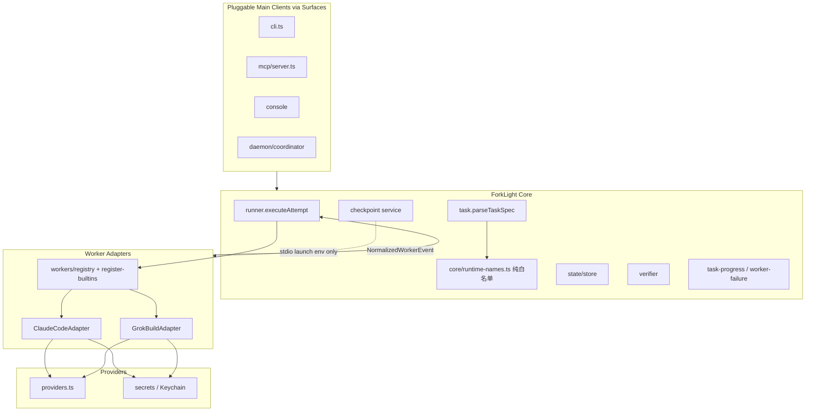

# ForkLight 双平面可插拔 Runtime — Main Client + Worker Adapter

| 字段 | 值 |
| --- | --- |
| 文档标题 | Dual-plane pluggable runtimes — Main Client + Worker Adapter |
| 作者 | TBD |
| 日期 | 2026-07-25 |
| 状态 | Approved direction (r4 — Main 与 Worker 均可插拔；Worker 工程细节继承 r3 review consensus) |
| 基线仓库 | `/Users/yijunwang/code/forklight` |
| 产品版本 | `0.2.0` UNLICENSED · macOS-only · Node ≥ 24 |
| 相关 Spec | `docs/superpowers/specs/2026-07-23-forklight-lean-core-refactor-design.md` |
| Grok 文档 | `~/.grok/docs/user-guide/14-headless-mode.md`, `18-sandbox.md`, `22-permissions-and-safety.md`, `05-configuration.md`, `07-mcp-servers.md`, `02-authentication.md`, `17-sessions.md` |

---

## Overview

ForkLight 要把「谁在编排」和「谁在改代码」都从单一产品绑定中解放出来：

| 平面 | 今天的默认印象 | 目标 |
| --- | --- | --- |
| **Main（编排客户端）** | 文档/话术默认 **Codex** | **可插拔**：Claude Code / Grok Build / OpenCode / Codex / 人 + CLI 等，凡能驱动控制面者皆可 |
| **Worker（执行器）** | 只 spawn **Claude Code** | **可插拔**：同一状态机下按 `runtime.name` 分发 CC / Grok Build / OpenCode / 未来 Codex-as-Worker |

**两平面接口不同、方向相反：**

- **Main 调用 ForkLight**（MCP / CLI / Console）——写契约、submit、wait、主审、授权。
- **ForkLight 调用 Worker**（`WorkerAdapter.run`）——在隔离 workspace 里跑 **单次 Attempt**。

同一产品（例如 Grok）可以**同时**充当 Main 与 Worker，但是 **两个角色、两套边界**，不是同一个 adapter 槽位、也不共享同一 sandbox session。

本设计因此分两块：

1. **Main Client 中立**：控制面契约与文案不绑定 Codex；可选 per-client 包装（skill / plugin / AGENTS 片段）。
2. **WorkerAdapter 框架**（r1–r3 已评审）：静态注册表、能力矩阵、CC 零回归、Grok MVP 隔离与 checkpoint 门控。

**不改变**：粗粒度 `TaskStatus` / `AttemptStatus`、独立 Verifier 权威性、「Worker 不能自证验收」、Economics 不伪造官方账单、单 Attempt = 单 Worker 调用。

---

## Background & Motivation

### 当前状态（代码事实）

| 位置 | 现状 |
| --- | --- |
| `src/core/types.ts` `RuntimeSpec` | `name: "claude-code"` 单值字面量 |
| `src/core/task.ts` `parseTaskSpec` | `runtimeName !== "claude-code"` 直接 throw |
| `src/core/runner.ts` `executeAttempt` | `worker = await runClaudeWorker(...)`；终态 `verification.passed && checkpointSatisfied(...)` |
| `src/workers/claude.ts` | spawn、`sandbox-exec`（**deny home 读**除 workspace/claudeConfig/runtime/checkpoint）、tool allow/deny、`--max-budget-usd`、`--mcp-config`（argv 注入）、`ClaudeEventNormalizer`、watchdog |
| `src/events/normalize.ts` | 仅 `ClaudeEventNormalizer` |
| `src/mcp/server.ts` `inlineTask` / `taskInputSchema` | 无 runtime 字段；硬编码 `claude-code` + `claude` |
| `src/daemon/coordinator.ts` | `health.ok = claude available && any provider ready`；`looksLikeWorker` ≈ `claude\|sandbox-exec` |
| `src/core/config.ts` `TaskPaths` | `claudeConfig` → `…/claude-config` |
| `src/core/settings.ts` | `SETTINGS_VERSION = 1`；`execution` 字段白名单；无 `defaultRuntime` |
| Surfaces | CLI / MCP `list_summaries`、`failureCategory`、`TaskDecisionView.progress` 依赖归一化 `EventType` |

### 痛点

1. **Worker Runtime 写死 CC**；扩展任一新 CLI 都要改 runner / types / MCP / health。
2. **Main 话术/插件默认 Codex**；CC / Grok / OpenCode 当编排方时缺少一等公民说明与包装。
3. 能力差异无法表达（budget 旗标、checkpoint 注入、usage 形态）。
4. CC 权限测试与业务状态机耦合，缺 adapter 契约测试。
5. Owner 概念模型（**Main 与 Worker 均可插拔，但平面不同**）未完整落代码与文档。

### 产品概念模型（双平面可插拔）

```text
        可插拔 Main Clients（调用 ForkLight）
   ┌──────────┬──────────┬──────────┬──────────┐
   │  Claude  │   Grok   │ OpenCode │  Codex   │  (+ 人直接 CLI)
   │  Code    │  Build   │          │          │
   └────┬─────┴────┬─────┴────┬─────┴────┬─────┘
        │ MCP/CLI  │          │          │
        └──────────┴────┬─────┴──────────┘
                        ▼
        ┌───────────────────────────────────────┐
        │ ForkLight Core（runtime-agnostic）      │
        │ 状态机 · Store · Verifier · Surfaces   │
        └───────────────────┬───────────────────┘
                            │ WorkerAdapter.run
              ┌─────────────┼─────────────┐
              ▼             ▼             ▼
        可插拔 Workers（被 ForkLight spawn）
        Claude Code    Grok Build    OpenCode / …
```

| 维度 | Main Client | Worker Runtime |
| --- | --- | --- |
| 方向 | **调用** ForkLight | **被** ForkLight **调用** |
| 职责 | 契约、submit/wait、主审、用户授权、Integration 决策 | 隔离 workspace 内实现 **一次 Attempt** |
| 接口 | MCP tools + CLI + Console（**同一控制面**） | `WorkerAdapter`（doctor / run / normalize） |
| 可插拔单位 | 任意能调控制面的 agent 环境 + 可选 skill/plugin 包装 | `runtime.name` 注册表中的适配器 |
| 安全边界 | 操作者信任域（主机侧编排） | sandbox / tool deny / 无自证验收 |
| 典型组合 | Main=Grok，Worker=CC；Main=CC，Worker=Grok；Main=OpenCode，Worker=OpenCode（**两角色两 session**） | |

1. **Main 可插拔 ≠ Main 实现成 WorkerAdapter**。Main 是控制面客户端；Worker 是 spawn 适配器。
2. **Worker** = 一次 Task Attempt 的隔离执行体（单任务、单 attempt 进程语义不变）。
3. **状态机不变**：`submit → queued → preparing → running → verifying → succeeded|failed|interrupted → (resume/revise) → main review → user auth → integration`。
4. **Provider 与 Worker Runtime 正交但配对 fail-closed**（见 §8.2）。
5. **同产品双角色允许，同 session 混角色不鼓励**（Main 会话不直接等于 Worker sandbox session）。
6. **能力差异诚实声明**——不发明官方成本、不伪造 budget 旗标、不假写 checkpoint。

---

## Goals & Non-Goals

### Goals

**Main 平面**

1. 控制面（MCP tool 名/语义、CLI、Console）**对编排客户端中立**——不绑定 Codex 为唯一 Main。
2. 文档与 `SERVER_INSTRUCTIONS` / AGENTS 片段用「Main agent」而非「Main Codex」；说明 CC / Grok / OpenCode / Codex 均可作为 Main。
3. 可选 **Main Client Pack**（薄包装，非核心状态机）：各环境如何安装 MCP、常用工具顺序（validate → submit → wait → inspect → main_review）。**不**要求每个 Main 有独立 daemon。

**Worker 平面**

4. `WorkerAdapter` 接口 + 静态注册表；`executeAttempt` 按 `runtime.name` 分发。
5. Claude 薄封装为零回归 `ClaudeCodeAdapter`。
6. `RuntimeName` **单一类型源**；parse 用纯白名单；历史 `claude-code` 零迁移。
7. 能力矩阵 + 归一化事件最小集；**可实现的 Grok MVP**（隔离 / 凭证 / checkpoint 门控 / spike 门槛）。
8. 增量 PR；工程师可按文档实现 Worker **PR1** 与（spike 后）**PR4**，以及 Main 中立 **PR0/PR-M**。

### Non-Goals

- 不重写 Pricing / Token Economics / Plan / Competition **算法**（允许最小增量：`ProviderName` 增加 `xai`）。
- **不把 Main 实现成 `WorkerAdapter`**（接口方向不同）；允许同产品双角色，**不**鼓励同一 sandbox session 既 Main 又 Worker。
- 不改变 Verifier 权威性；Worker 不得自证「已验收」。
- MVP **不** 为 Grok 实现可被 Worker 篡改的 workspace MCP checkpoint。
- 不动态加载第三方 Worker adapter；Main 侧也不做任意远程插件市场。
- Competition **不** 支持 per-candidate runtime 覆盖（MVP）。
- 不为每个 Main 客户端 fork 一套状态机或 Store。

---

## Proposed Design

### 0. 双平面契约（r4 产品决议）

| 问题 | 决议 |
| --- | --- |
| Main 是否可插拔？ | **是**。任何能稳定调用 MCP/CLI 的编码环境都可当 Main。 |
| Worker 是否可插拔？ | **是**。经 `WorkerAdapter` 注册的 runtime。 |
| 是否同一接口？ | **否**。Main = 控制面客户端；Worker = spawn 适配器。 |
| Codex 地位？ | **一等公民 Main 之一**，不再是唯一 Main；也可后续做 Worker。 |
| 状态机谁拥有？ | **仅 ForkLight Core**；Main 换皮、Worker 换执行器都不改状态迁移表。 |

**Main Client Pack（可选交付物，非 Core）**

| 客户端 | 包装形态（建议） | 最低要求 |
| --- | --- | --- |
| Codex | 现有 / 将更新的 plugin 或 AGENTS 说明 | 能调 `forklight_*` MCP |
| Claude Code | skill / MCP 配置片段 + 工具顺序 | 同上 |
| Grok Build | skill 或 project rules + MCP | 同上 |
| OpenCode | 文档 + MCP 配置 | 同上 |
| 人类 | CLI / Console | 无需 agent |

Main 平面 **验收**：用「非 Codex」客户端完成 validate → submit → wait → status（含 progress）→ inspect 摘要，无需改 Core 状态机。

### 0.1 上下文所有权（实现时勿忘）

三方各管一截；**禁止**把 Main 聊天 transcript 整段同步进 Store，也**禁止**让 Worker 读写 Main 的会话目录。

| 上下文类别 | 所有者 | 持久化位置 | 跨会话如何续 | 实现注意 |
| --- | --- | --- | --- | --- |
| Main 对话 / 工具轨迹 | **Main 应用** | 各 runtime 自有 session（`~/.codex`、`~/.grok/sessions`、CC 项目会话等） | 应用自己的 resume；**与 Task 无自动绑定** | ForkLight 不备份、不迁移 Main 会话 |
| 「当前跟进哪个 Task」 | **Main 工作记忆** + 操作者 | 建议 Main 只记 `taskId`（UUID）；可用 `forklight_list` 恢复 | 换 Main 应用 / 新对话 → 用 **同一 `FORKLIGHT_HOME` + taskId** | Skill 文案应写「记录 taskId」，不要写「依赖本会话 history」 |
| Task 权威状态 | **ForkLight Core** | `StateStore`（task / attempt / event / integration） | 任意 Main 调 status/wait/inspect | 唯一真相源 |
| Worker 编码 session | **ForkLight 持有 ID，runtime 持有内容** | `Task.sessionId` + adapter 侧目录（CC：`paths.claudeConfig`；Grok：task-local `GROK_HOME`） | resume/revise → adapter 用同一 `sessionId`（规则见 §5.4） | 不把 Main sessionId 传给 Worker |
| Worker 工作区文件 | **ForkLight** | `task.paths.workspace` | Attempt 间保留；Integration 才进源树 | Worker 不得以源仓库为 cwd（除非未来显式模式，MVP 不做） |
| 主审 / 授权结论 | **ForkLight Event** | `main-review.*`、integration receipts | inspect / decision view | Main 只提交结构化 decision+reason，不整段粘贴私聊 |
| Provider 凭证 | **OS Keychain + settings** | keychain service/account | 与 Main 应用登录态分离 | Worker env 只注入该 Task 需要的 key；Main 的 API key 不自动等于 Worker |

**桥接规则（固定）：**

```text
Main context ──(MCP/CLI: taskId, 契约, feedback, review)──► ForkLight Store
ForkLight Store ──(spawn: task, attempt, sessionId, workspace)──► Worker context
```

- 下行：契约与反馈文本由 Core 写入 Worker prompt；**不**注入 Main 的完整 tool log。  
- 上行：仅归一化 `NormalizedWorkerEvent` + diff/verify 结果；**不**把 Worker 原始 stream 原样塞回 Main context（Main 通过 inspect/status 拉取摘要）。

### 0.2 跨应用如何调用（统一控制面）

原则：**所有 Main 应用走同一控制面；所有 Worker 走同一 Adapter 分发。**  
「在哪个 App 里点运行」只决定 **Main 客户端**；**Worker** 由 Task 的 `runtime.name`（或 `defaultRuntime`）决定，**默认不随 Main 自动切换**。

#### Main → ForkLight（编排调用）

| Main 应用 | 调用通道 | 配置落点（实现/文档必须写清） | 包装交付物（Main Client Pack） |
| --- | --- | --- | --- |
| Codex | MCP `forklight_*` | Codex MCP / 现有 `plugins/forklight` | 更新 skill：中性 Main 措辞 + 工具顺序 |
| Claude Code | MCP | 用户/项目 MCP JSON（`mcpServers.forklight` → `forklight-mcp` 或等价） | `docs/main-clients/claude-code.md` + 可选 skill 片段 |
| Grok Build | MCP | Grok MCP 配置（见 Grok `07-mcp-servers.md`）；**不要**写进 Worker workspace | `docs/main-clients/grok-build.md` + skill/rules |
| OpenCode | MCP 或 CLI 子进程 | OpenCode 配置中的 MCP；或 shell 调 `forklight` CLI | `docs/main-clients/opencode.md` |
| 人类 / CI | CLI / Console | `FORKLIGHT_HOME`、PATH 上的 `forklight` | operations 文档即可 |

**每个 Main Client Pack 最少必须包含（PR-M0 / PR5 检查清单）：**

1. **如何连上同一 daemon**：MCP 启动命令、`FORKLIGHT_HOME`（若需）、health 第一步。  
2. **标准工具顺序**：`validate` → `submit` → `wait`（或克制 status）→ `inspect` → `main_review` →（用户）integration。  
3. **必须记住的标识**：`taskId`；可选记录 `runtime` / `provider` 便于排障。  
4. **禁止事项**：不要让 Main 在源仓库直接当 Worker 改同一任务的隔离语义；不要用 Main session 代替 `taskId`；不要跳过独立 verify 叙事。  
5. **与 Worker 选型的关系**：「当前 Main=Grok」**不**自动设置 `runtime: grok-build`；若产品要「跟随 Main」必须是**显式**设置项（见下），MVP 默认 **不跟随**。

#### ForkLight → Worker（执行调用）

| 配置来源 | 优先级（建议写进 parse/settings） | 说明 |
| --- | --- | --- |
| Task / MCP submit 显式 `runtime` | 最高 | 契约作者选定 Worker |
| `settings.execution.defaultRuntime` | 次 | 操作者机器默认 |
| 内置默认 `claude-code` | 最低 | 兼容今日 |

Daemon：`getWorkerAdapter(name).run(...)` → `spawn(executable, args, env, cwd=workspace)`。  
**与哪个 App 正在当 Main 无关。**

#### 可选产品策略（非 MVP 默认，但方案预留，免实现时误做成隐式）

| 策略 | 行为 | MVP |
| --- | --- | --- |
| **独立选择（默认）** | Main 客户端与 `runtime.name` 正交 | **是** |
| **跟随 Main** | 若 Main 声明身份且对应 Worker 已注册，submit 可默认填同名 runtime | 否；需显式 settings 如 `defaultRuntimeFollowsMainClient: false` |
| **强制分离** | 禁止 Main 产品名与 Worker 相同 | 否；一般不需要 |

实现时若未读本节，**禁止**静默「检测到 Grok MCP 就改 defaultRuntime」。

### 0.3 Main Client Pack 目录约定（免后续忘记）

建议仓库布局（PR-M0 可先建骨架 + 一篇完整示例）：

```text
docs/main-clients/
  README.md                 # 总览：双平面、taskId 桥、不跟随默认
  claude-code.md
  grok-build.md
  opencode.md
  codex.md                  # 从「唯一 Main」改为「之一」
plugins/forklight/…         # 现有 Codex 向包装继续维护，措辞中性化
```

每篇 client 文档固定小节标题：`Install MCP` · `Tool order` · `taskId continuity` · `Choosing Worker runtime` · `Limits`。

### 1. Layering



| 层 | 职责 | **禁止** |
| --- | --- | --- |
| Main Surfaces | 提交、监督、主审、授权 | 解析 runtime 原始流；直接 spawn 编码 CLI |
| Core | 状态机、验证、checkpoint 服务、Remediation | 硬编码某 CLI 参数；从 parse 路径 import 具体 adapter |
| WorkerAdapter | doctor、capability、launch、归一化、中断 | 调用 `verifyTask`；伪造 `checkpoint.completed`；自签 succeeded |
| Provider | 身份、endpoint、Keychain、env 形态 | 决定 sandbox profile |

**分层铁律（防环）**：

- `src/core/runtime-names.ts`：**仅** `RuntimeName` 联合类型 + `SUPPORTED_RUNTIME_NAMES` 常量 + type guard。**零** 依赖 `workers/*`。
- `parseTaskSpec` **只** import `runtime-names`，**不** import registry / adapter。
- `getWorkerAdapter` 仅在 `executeAttempt` / doctor / health 路径使用。
- Adapter 可 import `buildWorkerPrompt` / checkpoint / providers；**不得** 被 parse 路径反向依赖。

### 2. 状态机不变性

#### 2.1 不动

`TaskStatus` / `AttemptStatus`；`verifyTask` / PathPolicy / patch；Remediation；main-review / integration；`failureCategoryForTask`；progress / list_summaries。

#### 2.2 分发点

| 模块 | 变更 |
| --- | --- |
| `runner.executeAttempt` | `getWorkerAdapter(name).run(...)` |
| `runner` 终态 | **capability-aware checkpoint 门控**（见 §8.3 / §KD-Checkpoint） |
| `task.parseTaskSpec` | 白名单 + **provider×runtime 配对表** |
| `mcp/server` | schema + `inlineTask` 去硬编码 |
| `daemon.health` / `looksLikeWorker` | 多 runtime |
| `workers/*` | adapter + registry |

#### 2.3 时序

```mermaid
sequenceDiagram
  participant Main as Main
  participant Core as Core
  participant Ad as WorkerAdapter
  participant WS as Workspace
  participant V as Verifier

  Main->>Core: submit / resume
  Core->>Core: prepare workspace; create Attempt
  Core->>Ad: run(ctx)
  Ad->>WS: spawn (sandbox + tools policy)
  Ad-->>Core: NormalizedWorkerEvent stream
  Ad-->>Core: WorkerExecutionResult
  alt interrupted | worker failed
    Core->>Core: terminal without verify
  else worker process-ok
    Core->>V: verifyTask
    Core->>Core: checkpoint gate (satisfy | skip if unsupported)
    Core->>Core: succeeded | failed
  end
```

### 3. 单一类型源：`RuntimeName`

**唯一权威定义**（PR1 起）：

```typescript
// src/core/runtime-names.ts
/** Single source of truth for runtime ids. */
export const SUPPORTED_RUNTIME_NAMES = ["claude-code"] as const;
// PR4 在同一文件同一 commit 扩展为:
// export const SUPPORTED_RUNTIME_NAMES = ["claude-code", "grok-build"] as const;

export type RuntimeName = (typeof SUPPORTED_RUNTIME_NAMES)[number];

export function isRuntimeName(value: string): value is RuntimeName {
  return (SUPPORTED_RUNTIME_NAMES as readonly string[]).includes(value);
}

export function supportedRuntimeNamesList(): string {
  return SUPPORTED_RUNTIME_NAMES.join(", ");
}
```

使用点（全部 re-export / import 自此，**禁止** 另写并行 union）：

| 使用点 | 用法 |
| --- | --- |
| `RuntimeSpec.name` in `types.ts` | `name: RuntimeName` |
| `parseTaskSpec` | `isRuntimeName`；错误文案含 `supportedRuntimeNamesList()` |
| `workers/registry.ts` | `Map<RuntimeName, WorkerAdapter>` |
| MCP zod | `z.enum(SUPPORTED_RUNTIME_NAMES)`（或等价） |
| `execution.defaultRuntime` | `RuntimeName`，默认 `"claude-code"` |

PR1：union 仅 `"claude-code"`。PR4：**一个 commit** 把 `"grok-build"` 加入常量并接通全部站点。

`WorkerRuntimeName` **不要** 作为第二定义；`workers/types.ts` 写：

```typescript
import type { RuntimeName } from "../core/runtime-names.js";
// use RuntimeName everywhere
```

### 4. WorkerAdapter 接口

```typescript
// src/workers/types.ts
import type { ChildProcess } from "node:child_process";
import type { RuntimeName } from "../core/runtime-names.js";
import type {
  AttemptRecord, AttemptTokenUsage, NormalizedWorkerEvent, TaskRecord,
} from "../core/types.js";
import type { StateStore } from "../state/store.js";
import type { ExecutionSettings, ProviderDefaultSettings } from "../core/settings.js";

export type CapabilitySupport = "supported" | "partial" | "unsupported";

export interface WorkerCapabilityMatrix {
  budgetFlag: CapabilitySupport;
  checkpoint: CapabilitySupport;
  isolation: CapabilitySupport;
  toolsPolicy: CapabilitySupport;
  effortMapping: CapabilitySupport;
  costUsageFidelity: CapabilitySupport;
  sessionResume: CapabilitySupport;
  streamingEvents: CapabilitySupport;
  /**
   * What resets the no-progress watchdog.
   * CC: tool-lifecycle only.
   * Grok MVP: any-nonterminal-stream-event until tool events proven in fixture.
   */
  progressHeartbeat: "tool-lifecycle" | "any-nonterminal-stream-event";
}

export interface WorkerDoctorResult {
  runtime: RuntimeName;
  ok: boolean;
  executable: string;
  version?: string;
  issues: string[];
  capabilities: WorkerCapabilityMatrix;
}

export interface WorkerExecutionResult {
  status: "succeeded" | "failed" | "interrupted";
  exitCode: number;
  resultText?: string;
  costUsd?: number;
  turns?: number;
  error?: string;
  usage?: AttemptTokenUsage;
  runtimeCostEstimateUsd?: number;
}

export interface WorkerRunHooks {
  onSpawn?: (child: ChildProcess) => void;
  onEvent?: (event: NormalizedWorkerEvent) => void;
  wasInterrupted?: () => boolean;
  feedback?: string;
}

export interface WorkerRunContext {
  store: StateStore;
  task: TaskRecord;
  attempt: AttemptRecord;
  resuming: boolean;
  hooks?: WorkerRunHooks;
  execution?: ExecutionSettings;
  providerDefaults?: ProviderDefaultSettings;
}

export interface RuntimeSpecView {
  name: RuntimeName;
  executable: string;
  effort: "low" | "medium" | "high" | "xhigh" | "max";
  maxBudgetUsd: number | null;
}

export interface WorkerAdapter {
  readonly name: RuntimeName;
  readonly displayName: string;
  readonly defaultExecutable: string;
  capabilities(): WorkerCapabilityMatrix;
  doctor(): Promise<WorkerDoctorResult> | WorkerDoctorResult;
  validateSpec(runtime: RuntimeSpecView): void;
  effortArgs(effort: RuntimeSpecView["effort"]): string[];
  toolProtocolAppendix(task: TaskRecord): string[];
  checkpointProtocolAppendix(task: TaskRecord): string[];
  run(ctx: WorkerRunContext): Promise<WorkerExecutionResult>;
}
```

#### 4.1 Registry 与 bootstrap

```typescript
// src/workers/registry.ts — Map + get/list; throws if unknown / unregistered

// src/workers/register-builtins.ts
import { registerWorkerAdapter } from "./registry.js";
import { ClaudeCodeAdapter } from "./claude.js";
// PR4: import { GrokBuildAdapter } from "./grok.js";

export function registerBuiltinWorkers(): void {
  registerWorkerAdapter(new ClaudeCodeAdapter());
  // PR4: registerWorkerAdapter(new GrokBuildAdapter());
}
```

**必须** 在以下入口调用 `registerBuiltinWorkers()`（幂等：重复 register 同名覆盖或 no-op）：

- daemon bootstrap（`daemon` 主入口 / coordinator 构造前）
- `cli.ts` 主路径（含 local fallback runner）
- `mcp/main.ts`（若绕过 daemon 直接跑）
- 直接调用 `executeAttempt` 的测试 harness（或在 `runner` 模块顶层 lazy `ensureBuiltinsRegistered()`）

推荐 `ensureBuiltinsRegistered()` 在 `getWorkerAdapter` 内 lazy 一次，防止“忘了 register”：

```typescript
let builtinsReady = false;
function ensureBuiltinsRegistered(): void {
  if (!builtinsReady) {
    registerBuiltinWorkers();
    builtinsReady = true;
  }
}
```

失败模式：未知 name → 清晰错误 `Unsupported runtime.name=… Supported: …`。

#### 4.2 runner 分发

```typescript
const adapter = getWorkerAdapter(task.spec.runtime.name);
worker = await adapter.run({
  store,
  task: store.getTask(task.id),
  attempt,
  resuming,
  hooks: { onSpawn: forwarding.setChild, onEvent: onProgress, wasInterrupted: forwarding.wasInterrupted, feedback },
  execution: exec,
  providerDefaults: pd,
});
```

`WorkerExecutionResult` 与今日 `runClaudeWorker` 返回值同形 → interrupt/fail/verify 分支语义不变。

#### 4.3 process-runner：职责表（PR3 可选抽取）

| 职责 | 今日 `runClaudeWorker` | 共享 `process-runner`（若抽取） | Adapter 独有 |
| --- | --- | --- | --- |
| 构造 argv / env / sandbox launch | | | **是** |
| `worker.started` / `worker.resumed` payload（model, provider, runtime, isolation, budgetEnforced, checkpointMode） | 是 | **是**（接收 payload 工厂） | 提供字段 |
| stdout → rawLog tee | 是 | **是** | |
| stderr redact secret | 是 | **是**（`apiKeyForRedact?`） | 提供 secret |
| `parseLine` → events | normalizer | 调用 adapter 提供的 `parseLine` | normalizer |
| `store.addEvent` 每条非 terminal-interrupt 事件 | 是 | **是**（需 `store`, `taskId`, `attemptId`） | |
| watchdog 重置策略 | tool lifecycle | 按 `progressHeartbeat` | 声明 capability |
| watchdog vs user interrupt 优先级 | watchdog 先判 | **保持相同注释与顺序** | |
| double-write `worker.failed`（normalizer 分类 + runner 摘要） | 是 | **保持** | classifyFailure 文案 |
| terminal → `WorkerExecutionResult` | 是 | **是** | classifyFailure |

**PR 策略**：PR3 **不要求** Grok 依赖共享 runner。Grok MVP 可复制 CC 进程骨架；两个 adapter 稳定后再抽。若 PR3 滑动，PR4 自带副本亦可。

### 5. 归一化事件契约

复用 `NormalizedWorkerEvent` / `EventType`。

#### 5.1 每个 adapter 最小事件集

| 时机 | EventType | 要求 |
| --- | --- | --- |
| 启动 | `worker.started` / `worker.resumed` | payload: `model`, `provider`, `runtime`, `isolation`, `budgetEnforced: boolean`, `checkpointMode: "required"\|"unsupported-skipped"` |
| 工具开始/结束 | `worker.tool.started` / `completed` | CC 必须；Grok **若流中无 tool 事件则可不发**（改用 `progressHeartbeat`） |
| 叙述 | `worker.message` | summary ≤500 |
| 成功终态 | `worker.completed` | 可选 `claim: WorkerClaim`；`terminal.isError=false` |
| 失败终态 | `worker.failed` | 尽量带 `failureCategory` |
| 中断 | `worker.interrupted` | **由 core 写**（adapter 返回 `status:"interrupted"`） |

禁止 adapter 写：`verification.*`、`checkpoint.*`（服务端）、`main-review.*`、`integration.*`。

#### 5.2 Checkpoint skip 的 EventType 决策（**已定**）

**选择（1）扩展 `EventType`**：

```typescript
// src/core/types.ts EventType 增加：
| "checkpoint.skipped"
```

写入契约（core，在 verify 之前或之后、更新 Attempt 终态之前，**一次** per attempt）：

```typescript
store.addEvent(task.id, attemptId, "checkpoint.skipped", 
  "Checkpoint hard-gate skipped: runtime does not support controlled checkpoint", {
  authority: "non-authoritative-checkpoint",
  reason: "runtime-capability-unsupported",
  runtime: task.spec.runtime.name,
  capability: "unsupported",
});
```

| Surface | 行为 |
| --- | --- |
| progress / list_summaries / wait | 视为普通事件；`lastEventType` 可为 `checkpoint.skipped`；**不** 改变 terminal 判定 |
| `checkpointSatisfied` | **不** 把 skipped 当 completed |
| Decision View | 可展示“未跑 checkpoint（runtime 不支持）” |
| 统计 | 不计入 checkpoint 成功 |

**禁止** 用 `checkpoint.completed` 伪装 skip。

#### 5.3 终端 → Attempt 字段

与今日一致：`exitCode`, `resultText`, `costUsd`, `runtimeCostEstimateUsd`, `usage`, `turns`, `error`；`officialCost` 仍由 core `buildOfficialCost` 计算。缺 usage → 既有 unavailable 路径。**禁止** 填假 `usage.complete: true` 或 $0 账单。

#### 5.4 sessionId / resume 算法（全 runtime）

`TaskRecord.sessionId`：创建时 `randomUUID()`，全 Task 生命周期不变。

| 条件 | Adapter 行为 |
| --- | --- |
| `resuming === false` **或** 无任何 prior attempt 曾成功 spawn（见下） | **新 session**：CC `--session-id <uuid>`；Grok `-s/--session-id <uuid>`（必须 UUID；已存在则错误） |
| `resuming === true` 且 prior attempt 曾写入 `worker.started`（或 `pid` 曾非空） | **恢复**：CC `--resume`；Grok `-r/--resume <uuid>` |
| `resuming === true` 但从未成功启动 session（spawn/auth 失败） | **降级为新 session**（同 uuid 的“新建”）；若 Grok 报 “already exists” 而目录无状态，adapter 分类为 runtime 错误并提示清理 `GROK_HOME` |
| Runtime 回报不同 session id | 仅记入 event payload；**不** 改写 `Task.sessionId` |

`sessionResume` 能力：CC `supported`；Grok MVP **`partial`**（依赖 task-local `GROK_HOME`；外层 sandbox 下 resume round-trip 为 PR4 spike 验收项）。

### 6. RuntimeSpec 与 parse

#### 6.1 类型

```typescript
export interface RuntimeSpec {
  name: RuntimeName; // from runtime-names.ts
  executable: string;
  effort: "low" | "medium" | "high" | "xhigh" | "max";
  maxBudgetUsd: number | null;
}
```

- 省略 `name` → `"claude-code"`。
- `executable` 默认：CC `claude`；Grok `grok`（parse 内 switch 或小表，**不** 调 adapter）。
- 未知 name → throw（fail-closed）。
- **budget**：所有 runtime 仍按现有规则校验 `maxBudgetUsd`（正数或 null、≤ maximumBudgetUsd）。  
  **`budgetFlag=unsupported` 不导致 parse 失败**。语义为 **policy intent**（授权覆盖、经济学、Attempt.runtimeBudgetUsd）。  
  运行时：不传伪造 CLI flag；`worker.started` payload 含 `budgetEnforced: false`。

#### 6.2 Provider × Runtime 配对（fail-closed，**已定**）

| `runtime.name` | 允许的 `provider.name` | Worker env | `officialCost` |
| --- | --- | --- | --- |
| `claude-code` | `deepseek` \| `qwen` \| `minimax` \| `glm` | 现有 `providerEnvironment` → `ANTHROPIC_*` | 现有管线 |
| `grok-build` | **仅** `xai`（新增 `ProviderName`） | **仅** `XAI_API_KEY`（+ 最小 PATH 等）+ `GROK_HOME`；**禁止** 注入 `ANTHROPIC_*` | 若 terminal 有完整 usage/cost 且 pricing 身份可得则 quote；否则 **unavailable**（不得用 DeepSeek 价套 xAI token） |

**失败时机：`parseTaskSpec`（及 MCP/YAML 同一解析路径）** — 不延迟到第一次 `run`。

错误示例：

```text
runtime.name=grok-build requires provider.name=xai (received deepseek)
runtime.name=claude-code does not support provider.name=xai
```

**最小 Provider 增量（非重写）——PR4 全量触点清单（漏一处则 `npm run check` 失败或半注册）**：

```typescript
// providers.ts — type + registry
export type ProviderName = "deepseek" | "qwen" | "minimax" | "glm" | "xai";
// PROVIDER_NAMES / isProviderName / providerNames() include "xai"
// providerLabel("xai") → "xAI" (exhaustive switch)
// providerVariants("xai") → stub empty or single recommended endpoint (not Anthropic-compat)
// providerEnvironment(): **must throw or no-op for xai** — GrokBuildAdapter NEVER calls it
```

| # | 文件 / 站点 | 变更 |
| --- | --- | --- |
| 1 | `src/core/providers.ts` | union、`PROVIDER_NAMES`、`providerLabel`、`providerVariants` stub；**禁止** 为 xai 生成 `ANTHROPIC_*` |
| 2 | `src/core/settings.ts` | `ProviderDefaultsSettings.xai` 默认（`defaultModel` 如 `grok-build`，`defaultKeychainService: "forklight.xai.api-key"`，`defaultEndpoint` 可写 xAI API base 仅供文档/未来 probe）；`KNOWN_SECTIONS.providerDefaults`；`VALID_PROVIDER_NAMES`；`defaultProvider` 类型联合；cloneDefaults |
| 3 | `src/mcp/server.ts` | 所有 `z.enum(["deepseek",…])` 含 `provider` / competition `providerName` / probe 相关 → 加 `"xai"`（或抽共享 `providerEnum`） |
| 4 | `src/core/task.ts` | `isProviderName` 已覆盖即可；配对表 `assertProviderRuntimePair` |
| 5 | `src/core/competition.ts` | 仅校验 `isProviderName`；**不** 允许 candidate 换 runtime；xai 可作为候选 provider 仅当父 task runtime 为 grok-build（MVP 可直接：competition 仍默认 claude-code 父任务 → 配对使 xai candidate 在 parse/clone 失败——**文档化**：competition + grok 非 MVP） |
| 6 | `src/core/provider-probe.ts` | **xai 不走 Claude/Anthropic 探针**。行为（已定）：`probeProvider("xai")` → **keychain-existence only**（或立即 `status: "unverified"` / category `unsupported` 且 **不** spawn `claude`）。禁止对 xAI endpoint 发 CC 协议请求。 |
| 7 | `src/setup/*`（provider 列表 / 文案） | 列出 xai；副文案 *“Used with runtime grok-build”*；verify 按钮走 keychain-only，非 CC probe |
| 8 | `src/daemon/coordinator.ts` readiness | `providerNames()` 循环自动包含 xai；readiness = keychain exists（与 probe 一致） |
| 9 | `src/core/pricing.ts` / attempt-economics | xai **无** 价格表时走既有 `pricing-identity` unavailable → `officialCost` unavailable；**不** 用 deepseek 价 |
| 10 | `src/workers/grok.ts` | **自行** 组装 env：`XAI_API_KEY` + `GROK_HOME` + 最小 PATH；`assert never call providerEnvironment()` |
| 11 | 测试 | `providers`/`settings`/`mcp` 枚举含 xai；probe 不调用 claude；parse grok+xai ok、grok+deepseek throw |

Settings：`defaultProvider` 仍默认 `deepseek`。若 `defaultRuntime=grok-build` 且 `defaultProvider=deepseek`，**settings 校验失败**（见 §7.1），避免 silent 坏默认。**注意**：`assertProviderRuntimePair` 仅在 **双方名称均已进入白名单** 后有意义——即 PR4 同时加入 `grok-build` 与 `xai` 后启用完整配对测试；PR2 见 §7.1 测试拆分。

**Competition**：MVP 明确 **单 runtime = 父 Task 的 runtime**；`CandidateOverride` **不** 增加 runtime 字段。多 runtime 竞赛 = 非目标。父任务为 `claude-code` 时 candidate `providerName=xai` 应在校验失败（配对）。

**Stored tasks**：加载 **不** 再 parse。未知 `runtime.name` 在 `getWorkerAdapter` / attempt start 失败。手改 JSON 自负。

#### 6.3 executable 信任模型

与今日 CC 相同：`task.spec.runtime.executable` 是 **operator 信任输入**（可指向任意 path；`which`/`realpath` 解析）。多 runtime **不** 声称关闭 evil-wrapper。未来可选：目录 allowlist / hash pin（非本设计 MVP）。

### 7. Settings / MCP / Health

#### 7.1 `defaultRuntime`

```typescript
// ExecutionSettings
defaultRuntime: RuntimeName; // default "claude-code"
```

| 规则 | 行为 |
| --- | --- |
| 缺省字段 | mergeDefaults → `"claude-code"`（与其它新字段一致；**不强制** bump `SETTINGS_VERSION`，因 version 仍为 1 且缺失键可合并） |
| 非法值 | `validateSettingsDocument` **失败**，清晰错误：`execution.defaultRuntime must be one of claude-code, …` |
| 与 defaultProvider | **PR4+**：调用 `assertProviderRuntimePair(defaultProvider, defaultRuntime)`；不合法 → settings load 失败。**PR2**：`SUPPORTED_RUNTIME_NAMES` 仅含 `claude-code`，故任何 `defaultRuntime: grok-build` 在 runtime 白名单阶段已失败，**不要** 写“合法 grok+xai” settings 用例 |
| KNOWN_SECTIONS.execution | 增加 `"defaultRuntime"` |

**测试按 PR 拆分（避免与“PR2 不注册 grok-build”冲突）**：

| PR | `tests/settings.test.ts` / 相关 | 断言 |
| --- | --- | --- |
| **PR2** | mergeDefaults 含 `defaultRuntime: "claude-code"` | 缺省字段合并 |
| **PR2** | 合法 document 仅 `claude-code` | load 成功 |
| **PR2** | `defaultRuntime: "nope"` / `"grok-build"` | **非法 runtime 名** → validate 失败（此时 `grok-build` **尚未** 进白名单，失败原因是 unknown runtime，不是 pairing） |
| **PR2** | health 形状含 `runtimes` 键 | 仅已注册 adapter（CC）；无 Grok 注册 |
| **PR2** | MCP omit `runtime` | task `runtime.name === "claude-code"` |
| **PR4** | `assertProviderRuntimePair("xai","grok-build")` ok | 配对通过 |
| **PR4** | pair `deepseek`×`grok-build` / `xai`×`claude-code` | 拒绝 |
| **PR4** | settings `defaultRuntime: grok-build` + `defaultProvider: xai` | load 成功；+ `deepseek` → 失败 |
| **PR4** | parseTaskSpec YAML/MCP grok+xai / grok+deepseek | 接受 / 拒绝 |

#### 7.2 MCP changelog（PR2 可实现）

**Zod / taskInputSchema 新增**（均 optional）：

| 字段 | 类型 | 默认 |
| --- | --- | --- |
| `runtime` | enum `SUPPORTED_RUNTIME_NAMES` | settings `defaultRuntime` 或 `"claude-code"` |
| `runtimeExecutable` | string | adapter 默认 executable（parse 内表） |

YAML submit 与 MCP submit **共用** `parseTaskSpec` / `inlineTask` → 同一配对与 runtime 校验。

`inlineTask`：

```typescript
runtime: {
  name: input.runtime ?? settings.execution.defaultRuntime ?? "claude-code",
  executable: input.runtimeExecutable ?? defaultExecutableFor(name),
  effort: input.effort ?? settings.execution.defaultEffort,
  maxBudgetUsd: budget.maxBudgetUsd,
},
// provider 仍来自 input / defaults；parseTaskSpec 强制配对
```

**文案更新**：

- `SERVER_INSTRUCTIONS`（PR2）：改为“Worker runtime（默认 Claude Code）”；**不要** 在 PR2 宣传 Grok Build 为可用选项（runtime 白名单尚无 `grok-build`）。PR4 再补“可选 Grok Build + provider xai”。
- `forklight_health` description：返回多 runtime doctor（对**已注册** adapter 循环）。

**兼容**：旧客户端不传 `runtime` → 仍创建 `claude-code`（测试锁定）。

**list/status/inspect**：`runtime` 名已在 task.spec；capability **可选** 展示（非 MVP 阻断）。失败时 submit/run 错误带 `doctor.issues`。

#### 7.3 Health 响应与消费者

```json
{
  "ok": true,
  "claudeCode": "1.x…",
  "runtimes": {
    "claude-code": {
      "ok": true,
      "executable": "claude",
      "version": "…",
      "issues": [],
      "capabilities": { "budgetFlag": "supported", "…": "…" }
    },
    "grok-build": {
      "ok": false,
      "executable": "grok",
      "issues": ["executable not found"],
      "capabilities": { }
    }
  },
  "providers": { },
  "providerVerification": { }
}
```

| 字段 | 语义（过渡期，**已定**） |
| --- | --- |
| `ok` | **保持** `claudeCode !== unavailable && anyProviderReady`（兼容现有调用方） |
| `claudeCode` | **保留** 字符串字段（CLI doctor 输出、setup） |
| `runtimes` | 各已注册 adapter.doctor() |

**已知 `health.ok` / `claudeCode` 消费者**（回归清单）：

| 消费者 | 路径 |
| --- | --- |
| CLI doctor 文本 | `src/cli.ts`（`claudeCode`, `ok`） |
| MCP `forklight_health` | `src/mcp/server.ts` |
| Daemon ensure | `daemon/client.ensureDaemon` 调 health |
| Setup UI | setup server / health 展示 |

**Submit/run 门控**：若 `task.spec.runtime.name` 的 `doctor.ok === false`，attempt 启动失败，错误拼接 `issues`（即使全局 `health.ok === true`）。例如仅装了 CC 时提交 Grok 任务。

#### 7.4 adapter.doctor 定义（禁止误用 `grok doctor`）

CLI `grok doctor` = 终端/剪贴板诊断，**不是** auth readiness。Adapter doctor **不得** 依赖它做认证判断。

| 检查 | CC | Grok |
| --- | --- | --- |
| executable resolve (`which` / path) | 是 | 是 |
| `--version`（或 `version`）可执行 | 是 | 是 |
| 凭证 | Keychain 可读 provider key | Keychain 可读 `xai` key **或** 环境已有 `XAI_API_KEY`（doctor 在 **sandbox 外** 探测） |
| 不读 | — | 不把 `~/.grok/auth.json` 作为唯一路径（应用 `XAI_API_KEY` / task-local） |

### 8. Grok Build 适配器（实现级）

#### 8.0 PR4 进入门槛（强制 spike，非软注释）

在注册 `GrokBuildAdapter` 并宣称 PR4 可合入前，必须提交附录产物（`tests/fixtures/grok/` 或 `docs/…`）：

1. **Headless entrypoint 证明**：在临时 workspace 用选定 flags 跑一次会产生 **文件编辑** 的 prompt；确认 `-p` 走 agentic tool loop（官方文档：*“runs any necessary tools”* — `14-headless-mode.md`）。若不能改文件，改入口并更新映射表。
2. **streaming-json fixture**：至少含 `end`（及 text）；记录是否出现 tool 事件；据此锁定 `progressHeartbeat`。
3. **`GROK_HOME` + sandbox-exec resume round-trip**：attempt1 新 session → attempt2 `--resume` 在同一 task-local home 下可读历史。
4. **无 workspace MCP 文件** 的安全路径确认（checkpoint=unsupported）。
5. **MCP meta deny（A7）** + **`GROK_HOME` agent write deny（A8）**：最终 toolset 无 MCP meta；agent 无法写 `GROK_HOME`（或 cwd-bound 等价证明）。规则字面量写入 §8.6。

未满足 1–5：**不合并** Grok 注册。

#### 8.1 Headless 入口（研究结论 + 仍要 fixture）

| 问题 | 结论 |
| --- | --- |
| `-p/--single` 是否 agentic？ | 官方 Headless 文档：单次 **prompt** 非交互；**会跑必要 tools** 后退出。CI 示例用 `grok -p "Migrate…" --yolo`。 |
| 与 `grok agent` 关系 | `agent stdio/headless/serve` 为长期 agent 服务；ForkLight Attempt = 有界单 prompt 循环，**对齐 `-p`**。 |
| 输出 | `--output-format streaming-json`：`text` / `thought` / `end` / `error`（列表非穷尽）。**文档未保证 tool 事件** → normalizer 与 heartbeat 按 fixture 校准。 |
| 自动批准 | 无 TTY：使用 `--permission-mode dontAsk` **或** `--always-approve`/`--yolo`，并加 **deny** 规则；**不得** 裸 yolo 无 deny。 |

**映射表（provisional until spike fixtures；PR4 入口准则）**：

| 概念 | Claude Code | Grok Build |
| --- | --- | --- |
| Headless | `claude --print --output-format stream-json` | `grok -p <prompt> --output-format streaming-json` |
| cwd | spawn `cwd=workspace` | `--cwd <workspace>` + spawn cwd |
| 新 session | `--session-id <uuid>` | `-s/--session-id <uuid>`（UUID；已存在则错误） |
| Resume | `--resume <uuid>` | `-r/--resume <uuid>` |
| Model | `--model` + ANTHROPIC env | `-m/--model`（provider.model） |
| Effort | `--effort` | `--reasoning-effort` / `--effort`（canonical: low…max；ForkLight 无 `none/minimal` 则不传） |
| Budget | `--max-budget-usd` | **无** → `budgetFlag: unsupported`；`budgetEnforced: false` |
| Permission | `--permission-mode dontAsk` | `--permission-mode dontAsk` + deny 规则；必要时 `--always-approve` 仅当 deny 已覆盖 shell/web |
| Tools allow | `--tools` / `--allowedTools` | `--tools` **仅** 内置 ID：`read_file,grep,list_dir` +（allowEdits）`search_replace` 等编辑类（**不是** CC 的 Read/Glob） |
| Tools deny | `--disallowedTools` Bash/Web/Task | **必选**：`--disallowed-tools run_terminal_cmd,web_search,web_fetch,Agent` + `--disable-web-search`；**另必选 MCP meta deny**（见下） |
| MCP meta-tools | n/a（strict MCP config） | 官方：`--tools` allowlist 时 **MCP meta-tools 仍可用 unless denied**（`14-headless-mode.md`）。MVP **必须** 显式 deny（spike 锁定具体 flag/id；见 §8.1.1） |
| Path deny → `GROK_HOME` | sandbox 写隔离 | **MVP 必选**（非 optional）：permission `--deny` 禁止 agent 写入 `GROK_HOME` 与 workspace 外路径；spike **证明** 规则生效或证明工具无法写 cwd 外（§8.1.2 / Appendix A7–A8） |
| Checkpoint MCP | `--mcp-config` argv + `--strict-mcp-config` | **MVP 不注入** → unsupported；且无 MCP meta → 无法热挂服务器 |
| 沙箱 | 外层 `sandbox-exec` | 外层 `sandbox-exec` + 可选 `--sandbox workspace`（见 §8.4） |
| Subagents | deny Task | `--disallowed-tools Agent` 和/或 `--no-subagents` |
| Plan | n/a | `--no-plan` |
| Config root | `CLAUDE_CONFIG_DIR` | **`GROK_HOME=<task-local>`**；启动时 **不** 预写 `mcp_servers` 段；无 MCP 配置为默认 |

##### 8.1.1 MCP meta-tools deny（MVP 必选）

Headless 文档：allowlist 后 **MCP meta-tools remain available unless denied**；stock profile 可能在 allowlist 前注入 optional tools。

| 要求 | 说明 |
| --- | --- |
| 目标 | 最终 toolset **仅** 含 ForkLight 意图内置工具；无 MCP 列表/调用 meta；无 shell/web/Agent |
| argv（方向；**以 spike 记录的有效字符串为准**） | 在 `--disallowed-tools` 中加入文档化的 MCP meta 工具 id（若存在，如 list/call MCP helpers），**并且/或者** 重复 `--deny 'MCPTool'` / `--deny 'MCPTool(*)'`（`22-permissions-and-safety.md` 的 `MCPTool(...)` 前缀） |
| 验收 | Appendix **A7**：dry-run 或日志证明最终 toolset ⊆ 允许集合；含 MCP meta → **spike 失败，不合并 PR4** |
| 与 checkpoint | 即使未来误写 `config.toml` mcp_servers，无 meta + 无服务器配置 → 无法调用；双保险 |

##### 8.1.2 `GROK_HOME` 写路径 deny（MVP 必选，非“若支持”）

外层 `sandbox-exec` **必须** 允许 **Grok 进程** 写 task-local `GROK_HOME`（sessions）。Agent **文件工具** 不得写该树或 cwd 外路径（否则可改 `config.toml` 挂 MCP 或污染 session）。

| 步骤 | 要求 |
| --- | --- |
| Spike A8 | 证明其一：**（a）** permission 规则能拒绝写 `GROK_HOME` 下文件，或 **（b）** Grok 编辑类工具拒绝 cwd 外/绝对路径 |
| 若 (a) | MVP argv **必须** 包含已验证字符串，例如（示例，以 spike 替换）：`--deny "Write(<abs-GROK_HOME>/**)"`、`--deny "Edit(<abs-GROK_HOME>/**)"`，以及对称 deny workspace 外 `Write/Edit` 若模型尝试绝对路径 |
| 若仅 (b) | 文档记录“tools cwd-bound”；仍保留外层 sandbox；A8 用尝试写 `$GROK_HOME/pwned` 的 prompt 证明失败 |
| 若 (a)(b) 皆失败 | **阻塞 PR4**：不得仅靠“我们不写 MCP 配置”合并——Worker 可自建 `mcp_servers` |
| 映射表 | PR4 合入时用 **spike 实测通过** 的规则字符串替换本节 provisional 示例 |

#### 8.2 凭证与 Provider

- Keychain：`provider.name=xai` → `readProviderKey` 现有路径。
- Env：`XAI_API_KEY=<key>`（官方 CI 路径，`02-authentication.md` / `05-configuration.md`）。
- **不** 依赖 sandbox 内读取 `~/.grok/auth.json`。
- **不** 注入 `ANTHROPIC_*`；**不** 调用 `providerEnvironment()`。
- Redact：`XAI_API_KEY` 值进 stderr redact 列表。
- **Probe / setup（已定）**：`xai` = keychain existence only（§6.2 清单 #6–#7）；setup 文案 *“Used with runtime grok-build”*；**禁止** CC-based provider probe 打 xAI。

#### 8.3 Checkpoint：**unsupported** + core 门控（与 Grok 同 PR）

**Key Decision（checkpoint policy）**：当 `adapter.capabilities().checkpoint === "unsupported"` 时：

```typescript
// runner.executeAttempt 终态伪代码
const caps = getWorkerAdapter(task.spec.runtime.name).capabilities();
const checkpointPassed =
  caps.checkpoint === "unsupported"
    ? true
    : checkpointSatisfied(store.listEvents(task.id), attemptId, task.spec.acceptance.commands.length);

if (caps.checkpoint === "unsupported") {
  store.addEvent(/* checkpoint.skipped — §5.2 */);
}

const finalStatus = verification.passed && checkpointPassed ? "succeeded" : "failed";
```

| checkpoint capability | 行为 |
| --- | --- |
| `supported` | 现网：必须 `checkpoint.completed` 权威报告且全部 acceptance id 通过 |
| `partial` | **本 MVP 不使用**；未来仅在 **非 workspace 可写注入**（类 CC argv）就绪后启用 |
| `unsupported` | skip 硬门控 + `checkpoint.skipped` 事件；**独立 Verifier 仍必须通过** |

**安全：禁止 workspace 可写 MCP 配置作为 checkpoint 通道**

| 方案 | MVP |
| --- | --- |
| 写入 `workspace/.grok/config.toml` | **禁止**（Worker 可 Rewrite command → 任意进程） |
| `grok mcp add -s project` | **禁止**（同上） |
| 写入 `GROK_HOME/config.toml` 且 GROK_HOME 在 sandbox 可写 | **禁止作为 checkpoint 信任根**（Worker 若能写绝对路径仍可篡改） |
| CC 式 argv `--mcp-config` | **优选**；Grok 官方文档 **无** 等价 flag → MVP 不做 |
| checkpoint=unsupported | **采用** |

未来若 Grok 增加只读 argv/env MCP 注入，再升为 `supported`，并加与 `permissions.test.ts` 同级断言（配置不可被 Worker 工具改写）。

Prompt：`checkpointProtocolAppendix` 对 Grok 明确写：*“Controlled checkpoint tool is unavailable for this runtime; do not invent shell tests; ForkLight will run acceptance independently.”* 且 **不要** 要求 `mcp__forklight_checkpoint__run`。

#### 8.4 Grok isolation profile（解决 home deny vs auth/session）

**核心机制：`GROK_HOME` 任务本地化**（官方支持，`05-configuration.md` / `17-sessions.md`）：

```text
task.paths.claudeConfig/grok-home/     # 或 task.paths.root/grok-home/
  sessions/                            # session 持久化（进程可写）
  …                                    # Grok 自行管理的其它状态
  # 默认不创建含 [mcp_servers.*] 的 config.toml
```

**禁止** 为跑 Grok 而 `allow file-read*` 整个 `$HOME`。  
**禁止** 依赖“可选” path-deny：见 §8.1.2——agent 写 `GROK_HOME` 的防护为 PR4 spike **必过** 项。

##### 外层 `sandbox-exec` profile（相对 CC 的 delta）

在 CC profile 基础上：

**读允许（require-not deny-home）增加**：

- `GROK_HOME` 整树（task-local，**非** `~/.grok`）
- Grok **executable** 及其安装前缀（如 `~/.grok/bin` 与 realpath 后的二进制目录）— 仅 binary 运行所需；**不是** 用户 auth.json
- 既有 checkpoint runtime paths + daemon socket（若未来启用 checkpoint）
- 系统路径保持 `allow file-read*` 全局再 deny home 的既有模式

**写允许**：

- `task.paths.workspace`
- `GROK_HOME`（session 写入）
- `TMPDIR`
- daemon socket literal（若需要）

**仍 deny**：

- 用户 `$HOME` 下 **除** 显式 allow 的 executable 目录 / task paths 以外的一切（**包括** `~/Library/...` 密钥、其它项目、真实 `~/.grok/auth.json`）
- 原项目路径不在 workspace 映射内

若 Grok 二进制位于 `~/.grok/bin/grok`，只 allowlist：

- `realpath(executable)` 目录
- 其加载所需的 `~/.grok/bin` / `bundled` 只读子树（spike 用 `sandbox-exec` 试跑收紧；原则：**最小**）

##### 内层 Grok `--sandbox`

| Profile | 说明 | MVP |
| --- | --- | --- |
| `workspace` | 读广、写 CWD+GROK_HOME+tmp | 可与外层叠加；**外层已 deny 真 home** |
| `strict` | 读限 CWD+system | 更严；可能与工具读系统库冲突 — spike 选择 |
| `off` | 仅靠外层 | 可接受若外层完整 |

**不得** 因开启内层 sandbox 而去掉外层 `sandbox-exec`，除非 spike 证明冲突且等强。

##### 能力矩阵（Grok MVP，保守）

| 能力 | 值 | 说明 |
| --- | --- | --- |
| budgetFlag | **unsupported** | 无 CLI 硬停止 |
| checkpoint | **unsupported** | 无安全注入 |
| isolation | **partial** | 外层 sandbox + GROK_HOME + tool deny；非 CC 级证明前不标 supported |
| toolsPolicy | **partial** | 内部 tool id + deny shell/web/agent；与 CC 名不同 |
| effortMapping | **supported** | `--effort` 对齐 low…max |
| costUsageFidelity | **partial** | `end` 可有 `usage`/`total_cost_usd`（完整时）；缺则 omit；API-key 路径更可能有 cost（文档） |
| sessionResume | **partial** | GROK_HOME 本地化后预期可用；spike 证明前不标 supported |
| streamingEvents | **partial** | text/end 有；tool 事件待 fixture |
| progressHeartbeat | **any-nonterminal-stream-event** | 直至 tool 事件证实可改回 tool-lifecycle |

#### 8.5 Grok normalizer 草图

```text
streaming-json line type:
  text     → worker.message (truncate)
  thought  → optional worker.message or drop (prefer drop / debug only)
  end      → worker.completed | map stopReason; terminal usage/cost if present & complete
  error    → worker.failed + failureCategory (auth heuristics on message)
  *        → ignore unknown
```

Usage 映射到 `AttemptTokenUsage` 时：字段不全则 **整段 omit**；尊重 `usage_is_incomplete` / `cost_is_partial`（有则不填 complete cost）。

Watchdog：任一非 terminal 已解析事件可 `scheduleWatchdog`（当 `progressHeartbeat === any-nonterminal-stream-event`）。

#### 8.6 示例 argv（最终以 spike 为准）

```text
GROK_HOME=<task.paths.claudeConfig>/grok-home
XAI_API_KEY=<from keychain>

sandbox-exec -p <profile> \
  grok -p <prompt> \
    --cwd <workspace> \
    --output-format streaming-json \
    --permission-mode dontAsk \
    --disable-web-search \
    --no-subagents \
    --no-plan \
    --effort <mapped> \
    -m <provider.model> \
    --tools "read_file,grep,list_dir,search_replace" \  # allowEdits 时含编辑类
    --disallowed-tools "run_terminal_cmd,web_search,web_fetch,Agent,<mcp-meta-ids-from-spike>" \
    --deny "MCPTool" \                                   # 或 spike 验证的 MCPTool(*) 形式
    --deny "Write(<abs-GROK_HOME>/**)" \                 # A8 验证后写入；字面量以 spike 为准
    --deny "Edit(<abs-GROK_HOME>/**)" \
    --session-id <uuid> | --resume <uuid>
```

`allowEdits: false` 时从 `--tools` 去掉编辑类工具。PR4 合入前用 Appendix A7–A8 实测字符串替换尖括号占位。

### 9. OpenCode / Codex-as-Worker（后期）

仍为：实现 `WorkerAdapter` → 扩展 `SUPPORTED_RUNTIME_NAMES` → 配对表 → 契约测试。Codex-as-Worker 独立 session；不与 Main 共用。

### 10. Security & Privacy

| 威胁 | 缓解 |
| --- | --- |
| 读真 home 凭证 | deny-home + `GROK_HOME` 任务本地 + `XAI_API_KEY` env |
| Worker 改 MCP 逃逸 | 不注入 MCP；禁 workspace project MCP；**deny MCP meta**；**deny 写 GROK_HOME**（A7–A8） |
| 任意 Shell | deny `run_terminal_cmd` / Bash；无 Bash 工具 |
| 密钥进日志 | redact |
| 伪造验证 | Verifier 独立；不写假 checkpoint.completed |
| evil executable path | **operator 信任**（与 CC 同）；不夸大 |
| 动态插件 | 禁止 |
| CC probe 误打 xAI | xai probe = keychain-only |

测试：Grok launch profile 断言 **不** 出现裸 home allow；断言含 `GROK_HOME`；argv 含 MCP deny + GROK_HOME Write/Edit deny（或 cwd-bound 等价证明）；无 workspace `.grok` MCP。

### 11. Observability

- `worker.started`：`runtime`, `isolation`, `budgetEnforced`, `checkpointMode`
- `checkpoint.skipped`：审计
- `failureCategory`：跨 runtime
- raw JSONL + stderr
- `health.runtimes` + submit 时 doctor 失败信息

### 12. Testing Strategy

1. **CC 零回归**：现有 permissions / task / normalize / daemon / mcp；`npm run check`。
2. **契约测试**：每注册 adapter 的 capabilities / doctor 不抛 / validateSpec / mock 流。
3. **runtime-names / 配对**：**PR4** parse 拒绝 grok+deepseek、接受 grok+xai；**PR2** 仅默认 CC + 非法 runtime 名。
4. **checkpoint skip**（PR4）：unsupported + verify pass → succeeded + 一条 `checkpoint.skipped`。
5. **settings**：按 §7.1 表拆分 PR2 vs PR4。
6. **MCP**（PR2）：omit runtime → claude-code；health 含 runtimes 且 ok 语义不变。
7. **xai 触点**（PR4）：清单 §6.2 #1–11；probe 不 spawn claude。
8. **Grok fixture**：spike JSONL；A7–A8；可选 `FORKLIGHT_SMOKE_GROK=1`。

### 13. Rollout

| 阶段 | 内容 |
| --- | --- |
| PR1 | 框架 + CC；行为等价 |
| PR2 | `defaultRuntime` + MCP schema + health.runtimes；**不** 加 `grok-build` / `xai`；测试见 §7.1 PR2 行 |
| PR3 | prompt 中性化 + appendix API（**PR4 硬依赖**） |
| PR4 | `grok-build` + `xai` 全触点清单 + Grok adapter + checkpoint skip + isolation；spike A1–A8 |
| 回滚 | 去掉 grok 注册或强制 `claude-code` |

### 14. Alternatives Considered

#### A. 仅函数表  
缺 doctor/capability；拒绝为终态。

#### B. 分叉整条 runner  
双份验证链；拒绝。

#### C. 动态插件  
任意代码执行；拒绝。

#### D. Worker 本体也 MCP 化  
多余延迟；拒绝。

#### E. runner 内 `if (name==='grok')` 无 interface / 无 capability  
最小 diff 可先跑通，但第二 runtime 立刻复制状态机分叉与假能力风险；**拒绝**作为合入形态。允许私有 spike 分支实验，合入必须走 Adapter。

#### F. 仅抽 CC process-runner、暂无 interface  
可作微观步骤，但 PR1 目标即 dispatch 点；薄 interface 成本低于二次重构。

### 15. Risks & Mitigations

| ID | 风险 | 严重度 | 缓解 |
| --- | --- | --- | --- |
| R1 | CC 回归 | 高 | 薄包装 + 全量测试 |
| R2 | Grok 流无 tool 事件导致误杀 watchdog | 高 | `progressHeartbeat`；fixture |
| R3 | 真 home 放开 | 高 | `GROK_HOME`；最小 binary allowlist |
| R4 | workspace MCP 逃逸 | 高 | checkpoint unsupported |
| R5 | PR4 无门控永远 failed | 高 | skip 与 Grok **同 PR** |
| R6 | provider 误配记账 | 中 | parse 配对 + officialCost 规则 |
| R7 | 循环依赖 | 中 | runtime-names 纯模块 |
| R8 | health.ok 误导 | 低 | 文档 + submit doctor 门控 |
| R9 | prompt CC 词误导 Grok | 中 | PR3 硬依赖 |
| R10 | session 碰撞 | 中 | resume 算法 + task-local home |

### 16. Open Questions（均已标注 blocks）

| # | 问题 | 推荐 | blocks |
| --- | --- | --- | --- |
| Q1 | checkpoint unsupported：skip vs fail | **skip + event**（已升 Key Decision） | ~~PR4~~ **已关闭** |
| Q2 | Grok provider 身份 | **`xai` + 配对表**（已关闭） | ~~PR4~~ **已关闭** |
| Q3 | health.ok 未来是否跟 defaultRuntime | 过渡期保持 CC∧providers；以后另 RFC | non-blocking |
| Q4 | `TaskPaths.claudeConfig` rename | 不阻塞 | non-blocking |
| Q5 | Grok 内层 `--sandbox` 与外层叠加 | spike 选 workspace 或 off | **PR4 spike** |
| Q6 | streaming-json 是否含 tool 事件 | fixture 决定 heartbeat | **PR4 spike** |
| Q7 | Grok 二进制依赖 `~/.grok/bin` 最小读集 | spike 收紧 allowlist | **PR4 spike** |
| Q8 | `xai` pricing 表是否 MVP 提供 | 无则 officialCost unavailable | non-blocking（可 PR4+） |

---

## API / Interface Changes

### Task YAML

```yaml
# 默认
runtime:
  name: claude-code
  executable: claude
  effort: high
  maxBudgetUsd: 0.5
provider:
  name: deepseek
  model: …

# Grok（PR4+）
runtime:
  name: grok-build
  executable: grok
  effort: high
  maxBudgetUsd: 0.5   # intent only; budgetEnforced: false
provider:
  name: xai
  model: grok-build   # 或当时默认模型 id
  keychainService: forklight.xai.api-key
```

### MCP

见 §7.2。

### EventType

新增 `checkpoint.skipped`（§5.2）。

### 模块路径

```text
src/core/runtime-names.ts      # 单一 RuntimeName 源
src/workers/types.ts
src/workers/registry.ts
src/workers/register-builtins.ts
src/workers/claude.ts          # ClaudeCodeAdapter + 现有 helpers
src/workers/grok.ts            # PR4
src/workers/grok-normalize.ts  # PR4
src/events/normalize.ts        # Claude 保留
```

---

## Data Model Changes

- 无新表。
- `RuntimeSpec.name` / 可选 `ProviderName` 增 `xai`。
- `EventType` + `checkpoint.skipped`。
- Attempt 字段不变；`runtimeBudgetUsd` = 意图。
- 历史任务不迁移；load 不重 parse。

---

## Key Decisions

0. **Main 与 Worker 双平面均可插拔** — Main 换客户端、Worker 换执行器；状态机只属于 Core。  
1. **Main 不是 WorkerAdapter**（接口/方向不同）— 但 **Main 也不是「只能是 Codex」**；Codex 是 Main 选项之一。  
2. **状态机与 Verifier 不变；Worker 侧仅 dispatch + capability-aware checkpoint 门控** — lean-core 单一事实链。  
3. **静态 `WorkerAdapter` + capability matrix** — 诚实差异；无动态第三方插件加载。  
4. **PR1 薄封装 CC 零回归** — 先合入 Worker 分发点。  
5. **`RuntimeName` 单一源 `core/runtime-names.ts`；parse 不 import adapter** — 防环。  
6. **归一化事件复用现有 EventType；skip 用新 `checkpoint.skipped`** — 可审计、不假完成。  
7. **Grok checkpoint = unsupported；skip 硬门控与 Grok 同 PR 上线** — 避免 PR4 任务永失败。  
8. **禁止 workspace/可写 GROK_HOME MCP 作为 checkpoint 信任根** — 防命令逃逸。  
9. **Grok 隔离 = `GROK_HOME` 任务本地 + `XAI_API_KEY` + 外层 sandbox；不开放真 home 读** — 对齐 CC 安全姿态。  
10. **Provider×Worker-Runtime 配对 fail-closed 在 parse；`grok-build` 仅 `xai`** — 防错误 env 与错记账。  
11. **Grok `sessionResume`/`isolation` 标 partial 直至 spike** — 不夸大 doctor。  
12. **PR3（Worker prompt 中性化）硬依赖 PR4**；process-runner 抽取不阻塞 Grok。  
13. **executable 为 operator 信任输入** — 与今日 CC 一致。  
14. **health.ok 过渡期语义不变**；submit 按 **Worker** runtime doctor 门控。  
15. **budget 无旗标时 parse 仍接受 maxBudgetUsd 为意图**；`budgetEnforced: false`。  
16. **Main 中立优先改文案与包装，不改协议** — MCP 工具语义保持；去掉 Codex 专属措辞与假设。  
17. **上下文三权分立** — Main 会话自管、Store 管 Task 真相、Worker session/workspace 由 Core+adapter 管；桥 = taskId + 控制面（§0.1）。  
18. **Main 与 Worker 选型默认正交** — 不因 MCP 客户端身份静默改 `defaultRuntime`；「跟随 Main」仅显式策略（§0.2）。  
19. **Main Client Pack 有固定清单与目录约定** — 实现 PR-M0/PR5 时按 §0.3 交付，避免只改一句 instructions。

---

## PR Plan

### PR-M0 — Main 控制面中立（可与 PR1 并行）

- **标题**：`docs+mcp: Main client neutrality (not Codex-only)`
- **依赖**：无
- **文件**：
  - `src/mcp/server.ts`：`SERVER_INSTRUCTIONS` 改为「Main agent」（列举 CC / Grok / OpenCode / Codex 均可）；强调 **taskId 桥** 与 **Worker 由 runtime 字段选择、不跟随 Main**
  - `AGENTS.md`、`README.md`、operations / 相关 dogfood 话术：去掉「必须 Codex 当 Main」
  - **必建** `docs/main-clients/README.md` + 至少 **一篇** 非 Codex 完整示例（建议 Grok 或 CC），章节符合 §0.3
  - 更新 `plugins/forklight/.../SKILL.md`：中性 Main + 工具顺序 + taskId continuity
- **描述**：产品叙事、上下文所有权（§0.1）、跨应用调用（§0.2）落入可执行文档；**零 Worker 行为变化**。
- **验收**：
  - 全文检索「Main Codex」仅保留历史/对照语境
  - §0.3 清单 5 条在示例 client 文档中可勾选
  - 读者能回答：Main 上下文谁管、Worker session 谁管、换 App 如何续 taskId

### PR1 — WorkerAdapter + Registry + Claude 薄封装（零回归）

- **标题**：`workers: introduce WorkerAdapter interface and ClaudeCodeAdapter dispatch`
- **依赖**：无
- **文件**：
  - 新增 `src/core/runtime-names.ts`（仅 `claude-code`）
  - 新增 `src/workers/types.ts`, `registry.ts`, `register-builtins.ts`
  - 修改 `src/workers/claude.ts`（export adapter；保留 `runClaudeWorker` / permissions helpers）
  - 修改 `src/core/runner.ts`（dispatch + **可选** lazy ensureBuiltins）
  - 修改 `src/core/types.ts`（`RuntimeSpec.name: RuntimeName`）
  - 修改 `src/core/task.ts`（`isRuntimeName`，**不** import registry）
  - 入口 import `registerBuiltinWorkers` / ensure
  - 测试：契约（CC）；全量现有测试
- **描述**：分发点落地；行为与今日 CC 等价。

### PR2 — Settings / MCP / Health（无 Grok / 无 xai）

- **标题**：`runtime: defaultRuntime, MCP schema, multi-runtime health`
- **依赖**：PR1
- **文件**：
  - `settings.ts`：`defaultRuntime`（仅校验 ∈ `SUPPORTED_RUNTIME_NAMES` == `claude-code`）、KNOWN_SECTIONS；**不加** xai / pairing 全表
  - `mcp/server.ts`：optional `runtime` / `runtimeExecutable` schema、inlineTask、SERVER_INSTRUCTIONS（默认 CC，**不** 宣传 Grok）、health 文案
  - `daemon/coordinator.ts`：`runtimes` map 循环 **已注册** adapter.doctor；保留 `ok`/`claudeCode`
  - `docs/configuration.md`：`defaultRuntime` 说明
  - 测试：**仅** §7.1 PR2 行（默认 CC、非法 runtime 含字面 `grok-build` 因未入白名单而失败、MCP omit → claude-code、health 形状）
- **描述**：**禁止** 本 PR 将 `grok-build` 加入 `SUPPORTED_RUNTIME_NAMES` 或引入 `ProviderName: xai`。pairing / grok+xai 测试属于 PR4。

### PR3 — Prompt 中性化 + appendix API（**PR4 硬依赖**）

- **标题**：`workers: runtime-aware prompt appendices (neutral tool protocol)`
- **依赖**：PR1
- **文件**：
  - `task.ts`：`toolProtocol` 中性描述；checkpoint 段改为调用方传入或 post-process
  - `buildWorkerPrompt(spec, resuming, feedback, appendices?)` 或 runner 在调 adapter 后拼接 appendix
  - Claude appendix 保持 `mcp__forklight_checkpoint__run` + CC 工具名
  - 测试：CC prompt 回归；appendix 注入点
  - process-runner：**可选**，不阻塞 PR4
- **描述**：禁止在注册 Grok 时仍教学 CC 工具名。

### PR4 — Grok MVP（隔离 + 配对 + checkpoint skip + adapter）

- **标题**：`workers: GrokBuildAdapter with task-local GROK_HOME and checkpoint skip`
- **依赖**：**PR1 + PR3**（硬）；PR2（强烈建议已合入 health/MCP）
- **进入门槛**：§8.0 + Appendix A（**含 A7 MCP meta deny、A8 GROK_HOME write deny**）
- **文件 / 清单**：
  - `runtime-names.ts`：+ `grok-build`（与全站点同一 commit）
  - **§6.2 Provider `xai` 触点表 #1–11 全部勾选**（providers、settings、MCP enums、probe keychain-only、setup 文案、pricing unavailable、grok env 自建）
  - `task.ts`：`assertProviderRuntimePair` + parse 测试（§7.1 PR4 行）
  - `types.ts`：`EventType` + `checkpoint.skipped`
  - `runner.ts`：capability-aware checkpoint 门控 + skip event
  - `workers/grok.ts`, `grok-normalize.ts`：argv 含 spike 锁定的 MCP deny + GROK_HOME path deny
  - `register-builtins` 注册 Grok；`looksLikeWorker` + `grok`
  - 沙箱 profile 单测；checkpoint skip 单测；permissions 级 argv 断言
- **描述**：第一个非 CC runtime 可用且可 succeeded（verify 通过时）。

### PR5 — 文档 / Console / Dogfood（Worker + Main）

- **标题**：`docs+console: multi-runtime operator surfaces`
- **依赖**：PR4；建议已合 PR-M0
- **文件**：README、configuration、operations、Console 展示 **Worker** runtime；Main Client Pack 示例（至少 1 个非 Codex：Grok 或 CC）
- **描述**：操作者能选「我的 Main 是 X、Worker 是 Y」。

### 后续

- Grok checkpoint→supported（仅当 argv/env 安全注入存在）
- OpenCode / Codex 作为 **Worker** adapter
- 更多 Main Client Pack（深度 skill，非 Core）
- `claudeConfig` rename
- xai 正式 pricing 表

---

## Appendix A — Grok isolation & headless spike checklist

| # | 动作 | 通过标准 |
| --- | --- | --- |
| A1 | Headless 编辑：`GROK_HOME=$TMP/gh XAI_API_KEY=… grok -p "create hello.txt with hi" --cwd $WS --output-format streaming-json --tools … --disallowed-tools run_terminal_cmd,web_search,web_fetch,Agent,<mcp-meta> --deny MCPTool… --deny Write/Edit($GROK_HOME/**) --permission-mode dontAsk -m …` | `hello.txt` 在 **workspace** 出现；进程退出 0 或可解释 |
| A2 | 保存完整 stdout JSONL | 含 `end`；记录 type 集合；校准 `progressHeartbeat` |
| A3 | 外层 sandbox-exec + 同 env 再跑 | 不读 `~/.grok/auth.json`；不写真 home |
| A4 | 同 GROK_HOME `--resume $id` 第二 prompt | 恢复上下文或明确错误 |
| A5 | 确认无写入 workspace `.grok/config.toml` MCP | 无文件或空；无预置 mcp_servers |
| A6 | 记录 binary 依赖路径 | 收紧 read allowlist |
| **A7** | **MCP meta deny**：在 A1 flags 下确认最终 toolset（日志 / doctor / 诱导 list MCP） | **无** MCP meta / MCPTool 可调用；记录生效的 `--disallowed-tools` / `--deny` 字面量 → 写入 §8.6 |
| **A8** | **GROK_HOME write deny**：prompt 尝试写 `$GROK_HOME/pwned.txt` 或改 `config.toml` | 写失败（permission deny 或工具拒绝 cwd 外）；记录规则。**若可写成功 → PR4 阻塞** |

---

## Appendix B — process-runner 事件双写语义（保持）

与 `src/core/worker-failure.ts` 注释一致：normalizer 可先写带 `failureCategory` 的 `worker.failed`，随后 runner 再写摘要 `worker.failed`（可无 payload）。`failureCategoryFromEvents` **newest-first 找带 category 的 payload**。任何共享 runner **必须** 保持此顺序与语义。

---

## References

- 代码：`types.ts`, `runner.ts`, `workers/claude.ts`, `events/normalize.ts`, `task.ts`, `mcp/server.ts`, `daemon/coordinator.ts`, `checkpoint.ts`, `worker-failure.ts`, `settings.ts`, `tests/permissions.test.ts`
- lean-core：`docs/superpowers/specs/2026-07-23-forklight-lean-core-refactor-design.md`
- `AGENTS.md`
- Grok：`14-headless-mode.md`（`-p` tool loop, streaming-json, session flags）、`18-sandbox.md`（profiles, GROK_HOME 可写）、`22-permissions-and-safety.md`、`05-configuration.md`（`GROK_HOME`, `XAI_API_KEY`）、`07-mcp-servers.md`（仅 config 文件配置）、`02-authentication.md`、`17-sessions.md`

---

## Revision Summary

- **r2**：响应 design review 全部 open issues：Grok `GROK_HOME` 隔离 profile；禁止可写 MCP checkpoint；checkpoint skip + `EventType` 与 Grok 同 PR；parse/registry 去环；provider×runtime 配对表（`xai`）；resume 算法；`-p` 研究结论 + spike 门槛；MCP/settings/health 可实现规格；单一 `RuntimeName`；PR 重排（PR3→PR4，门控并入 PR4）；capability 保守标注；executable 信任模型；Key Decisions / Open Questions 标注 blocks；附录 spike checklist 与 process-runner 职责表。
- **r3**：PR2/PR4 测试拆分（PR2 不测 grok+xai pairing）；`ProviderName: xai` 11 点触点清单 + probe/setup 行为；MCP meta-tools 必 deny；`GROK_HOME` agent 写 deny 升为 spike 必过（A7–A8）；示例 argv 与 PR4 文件列表对齐。
- **r4（产品决议）**：**Main 与 Worker 双平面均可插拔**。Main = 可换的控制面客户端（CC / Grok / OpenCode / Codex / 人），**不是** WorkerAdapter；Worker = 可换的 spawn 执行器。纠正 r1–r3 中「默认 Main=Codex」叙事；新增 PR-M0（Main 中立）与 Key Decision 0/16；同产品双角色允许、同 session 混角色不鼓励。
- **r4.1（补薄）**：新增 §0.1 上下文所有权表、§0.2 跨应用调用矩阵与「不跟随 Main」默认、§0.3 Main Client Pack 目录/清单；Key Decisions 17–19；PR-M0 验收绑定这些小节，避免实现阶段遗漏。
